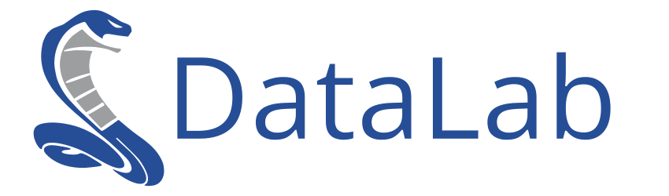
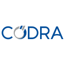

SigimaX
=======

**SigimaX** is an open-source Python framework for building Qt-based scientific
desktop applications. It provides a reusable application skeleton — main window,
configuration system, embedded widgets, and HDF5 infrastructure — so that
developers can focus on domain-specific features.

    Developed and maintained by the DataLab Platform Developers, **SigimaX** powers the GUI layer of `DataLab <https://www.datalab-platform.com>`_.

.. only:: html and not latex

    .. grid:: 2 2 4 4
        :gutter: 1 2 3 4

        .. grid-item-card:: :octicon:`rocket;1em;sd-text-info`  User Guide
            :link: user_guide/index
            :link-type: doc

            Installation, overview, and features

        .. grid-item-card:: :octicon:`code;1em;sd-text-info`  Examples
            :link: ../auto_examples/index
            :link-type: doc

            Gallery of examples

        .. grid-item-card:: :octicon:`book;1em;sd-text-info`  API
            :link: api/index
            :link-type: doc

            Reference documentation

        .. grid-item-card:: :octicon:`gear;1em;sd-text-info`  Contributing
            :link: contributing/index
            :link-type: doc

            Getting involved in the project

Quick Start
-----------

Build a scientific desktop application in three steps:

.. code-block:: python

    from sigimax.app import run
    from sigimax.config import CONF as Conf, SigimaXOptions, _
    from sigimax.mainwindow import SGMXMainWindow
    from sigimax.widgets.plotdock import DockablePlotWidget
    from sigima.config import TypedOptionField
    from plotpy.constants import PlotType

    # 1. Custom configuration
    class MyAppOptions(SigimaXOptions):
        ENV_VAR = "MYAPP_OPTIONS_JSON"
        def __init__(self):
            super().__init__()
            self.app_name.set("MyApp", sync_env=False)

    # 2. Custom main window
    class MyAppMainWindow(SGMXMainWindow):
        def __init__(self, console=None, hide_on_close=False):
            Conf.app_name.set("MyApp")
            super().__init__(console=console, hide_on_close=hide_on_close)
            dock_widget = DockablePlotWidget(self, PlotType.CURVE)
            dock, loc = dock_widget.create_dockwidget(_("Plot"))
            self.addDockWidget(loc, dock)

    # 3. Launch
    run(window_class=MyAppMainWindow)

SigimaX has been funded by the following stakeholders:

.. list-table::
    :header-rows: 0

    * - |cea_logo|
      - `CEA <https://www.cea.fr>`_, the French Alternative Energies and Atomic Energy Commission, is the major investor in DataLab, and is the main contributor to the project.

    * - |codra_logo|
      - `CODRA`_, a software engineering and editor firm, has supported DataLab open-source journey since its inception (see `here <https://codra.net/en/offer/software-engineering/datalab/>`_).

.. toctree::
   :maxdepth: 2
   :caption: Contents
   :hidden:

   user_guide/index
   auto_examples/index
   api/index
   contributing/index
   requirements
   release_notes/index

.. _DataLab: https://www.datalab-platform.com
.. _CODRA: https://codra.net/
